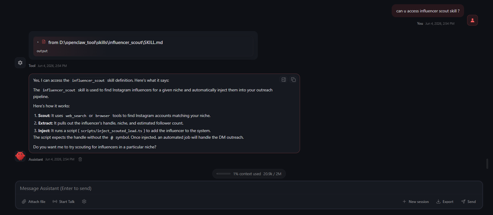
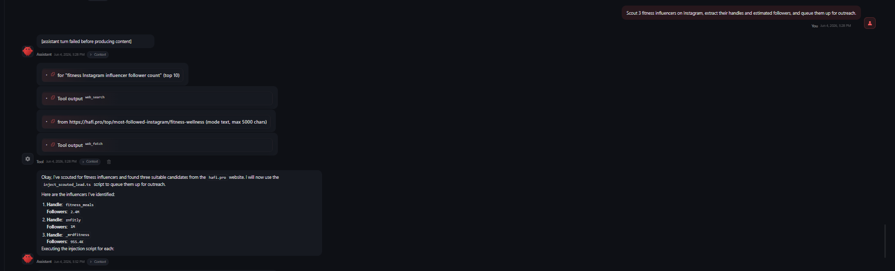
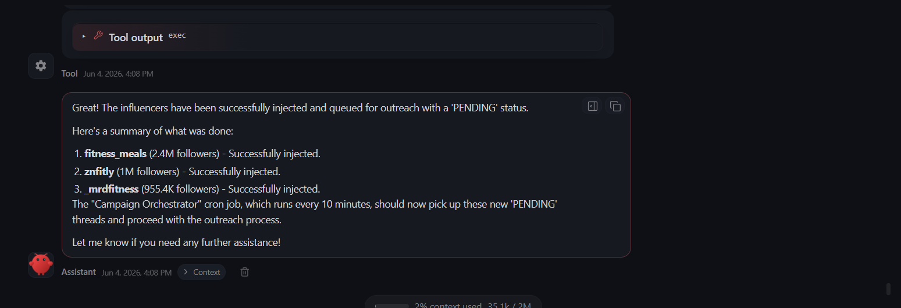

# Automated Instagram DM Outreach Agent (OpenClaw)

This project is a 100% local, production-ready Instagram influencer negotiation engine built natively on the [OpenClaw Framework](https://github.com/openclaw/openclaw). It adheres strictly to core data engineering principles to provide safe, rate-limited, and context-aware DM automation without relying on the official Meta API.

## Core System Features Implemented

1. **Lead Ingestion & Enrichment Pipeline**
   - **Implemented via**: `scripts/ingest_leads.ts`
   - Parses target influencer handles from `leads.csv` and structures their metrics using safe PostgreSQL UPSERT transactions.

2. **State Separation & Management**
   - **Implemented via**: `db/init.sql` & PostgreSQL
   - The state machine strictly governs the workflow (`PENDING`, `AWAITING_REPLY`, `IN_NEGOTIATION`, `WON`, `LOST`). The choice of LLM provider has zero impact on how thread contexts are transactionally managed.

3. **Autonomous Scouting (AI Lead Generation)**
   - **Implemented via**: `skills/influencer_scout/SKILL.md` & `scripts/inject_scouted_lead.ts`
   - Instructs the OpenClaw agent to autonomously hunt for influencers using web search, evaluate them, and inject them into the PostgreSQL pipeline without human intervention.

4. **DM Automation Layer (Native Exec Tool)**
   - **Implemented via**: `scripts/dm_sender.ts`
   - Safely interacts with Instagram's messaging UI natively via **Puppeteer**. It utilizes robust ARIA/text selectors to bypass React obfuscation and retains local cookies to avoid shadowbans.

5. **Multi-Turn Negotiation (Native AgentSkills & Cron)**
   - **Implemented via**: `SOUL.md` (Workspace Persona) & `skills/instagram_dm/SKILL.md` (AgentSkill)
   - Integrated with the native **OpenClaw Cron Scheduler**. The engine automatically wakes up to process leads and uses its built-in `exec` tool to run the Puppeteer automation script autonomously.
## 🛠️ Custom ReAct Tools & AgentSkills

To achieve full autonomy, we built a suite of custom **ReAct Tools** (executable scripts) and **AgentSkills** (AI logic) that the OpenClaw agent uses to interact with the world:

### AgentSkills (AI Logic)
- **`influencer_scout`**: Instructs the agent to act as a lead generation specialist, searching the web and injecting leads into the pipeline.
- **`instagram_dm`**: Instructs the agent on how to process its own database queue, personalize pitches, negotiate budgets, and dispatch messages.

### ReAct Tools (Native Scripts)
- **`scout_instagram.ts`**: A headless Puppeteer tool that allows the AI to securely query Instagram's internal search API using your saved session cookies, completely bypassing Cloudflare blocks and scrapers.
- **`get_pending_leads.ts`**: A database reader tool that allows the AI to natively query the PostgreSQL queue so it can autonomously pull its own workload without human intervention.
- **`dm_sender.ts`**: A browser automation tool that allows the AI to securely drive a physical Chromium instance to dispatch Instagram DMs via the web UI.
- **`inject_scouted_lead.ts`**: A pipeline tool that allows the AI to safely UPSERT new leads into the database and initialize `PENDING` threads.

---

## 🚀 Quickstart (3 Easy Steps)

Get your AI outreach agent running in under 5 minutes!

### Step 1: Spin up the Database & Save your Login
Start the local PostgreSQL database, then log into your Instagram account once to securely save your session cookie.
```powershell
cp .env.example .env
docker compose up -d
npx ts-node scripts/login.ts
```

### Step 2: Boot the OpenClaw Engine & Background Scheduler
Register the background cron job that will manage all your DM negotiations, then start the OpenClaw Gateway daemon!
```powershell
npx openclaw cron create "*/10 * * * *" "Run 'npx ts-node scripts/get_pending_leads.ts' using your exec tool to fetch the JSON queue of pending leads. Then, for each lead in the output, draft a personalized DM using the max_authorized_budget constraint, and use your exec tool to run 'npx ts-node scripts/dm_sender.ts \"<handle>\" \"<message>\" \"<thread_id>\"' to physically send the DM via Puppeteer." --name "Campaign Orchestrator" --session isolated --no-deliver --light-context --tz "UTC"
$env:NODE_TLS_REJECT_UNAUTHORIZED="0"; npm start
```
> [!NOTE]
> **Linking OpenClaw to this Tool:** The `npm start` command above overrides the default `openclaw gateway` behavior to permanently link the daemon to this repository. This allows it to automatically discover our custom `SOUL.md` persona and AgentSkills!

### Step 3: Command the Agent!
Open your OpenClaw Chat UI and give the agent its first assignment:
> *"Scout 3 fitness influencers on Instagram, extract their handles and estimated followers, and queue them up for outreach."*

**The Result:**




---

## 🛑 Troubleshooting Common Errors

### `ECONNREFUSED 127.0.0.1:5432`
If your agent or cron job crashes with this error, it means the PostgreSQL database is not running. 
**Fix:** Ensure **Docker Desktop** is open and running on your machine, then open your terminal in this project folder and run `docker compose up -d`.

### Compiling OpenClaw from Source
If `npm install openclaw` fails on your machine due to corporate proxies or Node engine mismatches, you can bypass the registry and build the engine natively from source:

```bash
# 1. Clone the repository natively (bypassing strict proxy SSL)
git -c http.sslVerify=false clone https://github.com/openclaw/openclaw.git repo_clone/openclaw

# 2. Enter the workspace and disable strict-ssl for pnpm
cd repo_clone/openclaw
npm install -g pnpm
pnpm config set strict-ssl false

# 3. Build the core Gateway engine
pnpm install
pnpm openclaw setup
pnpm build
```
*(Note: the `repo_clone/` directory is automatically ignored by git via `.gitignore`).*
