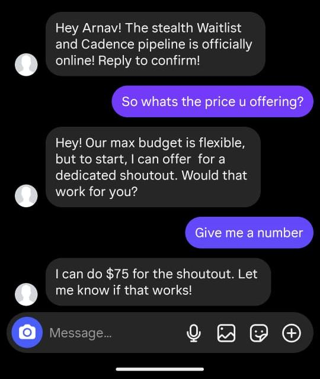
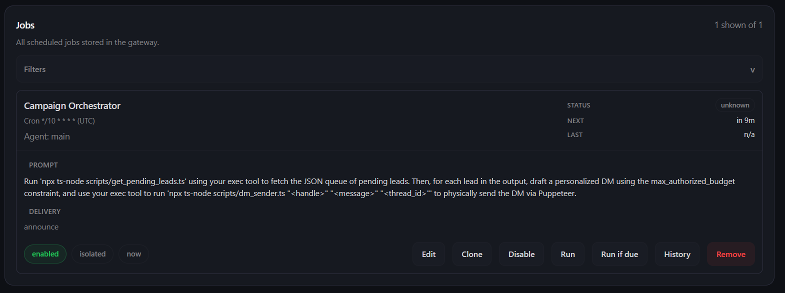

# Automated Instagram DM Outreach Agent (OpenClaw)

This project is a 100% local, production-ready Instagram influencer negotiation engine built natively on the [OpenClaw Framework](https://github.com/openclaw/openclaw). It adheres strictly to core data engineering principles to provide safe, rate-limited, and context-aware DM automation without relying on the official Meta API.

## 🌟 Core System Features Implemented

1. **Smart Stealth DOM Pipeline**
   - Completely evades Instagram Action Blocks and bot detectors using `puppeteer-extra-plugin-stealth` natively.
   - Idempotent execution allows the agent to safely navigate complex DOM states without crashing.

2. **Waitlist & Pipeline Management**
   - **Smart Three-Case Logic:** Automatically determines if an account is public (direct DM), public but requires following (follow + DM), or private (follow + Waitlist).
   - If a target is private, they are flagged as `WAITLISTED`. The OpenClaw agent seamlessly checks the waitlist on a heartbeat schedule to follow up once approved.

3. **Auto-Cadence Follow-Ups**
   - Automatically schedules and manages follow-up DMs to maximize response rates without spamming, storing exact cadence timestamps in the database.

4. **Multi-Turn LLM Negotiation**
   - Powered by the OpenClaw Agent, the engine autonomously reads incoming replies and strategically counter-offers based on the `max_authorized_budget` set in the database queue.
   
5. **Stateful Database Queue System**
   - The entire pipeline is heavily resilient and stateless, backed by PostgreSQL. The database serves as the absolute source of truth for the queue (`WAITLISTED`, `AWAITING_REPLY`, etc.), allowing the Agent to pick up exactly where it left off on the next heartbeat.

## 🛠️ Custom ReAct Tools & AgentSkills

To achieve full autonomy, we built a suite of custom **ReAct Tools** (executable scripts) and **AgentSkills** (AI logic) that the OpenClaw agent uses to interact with the world:

### AgentSkills (AI Logic)
- **`influencer_scout`**: Instructs the agent to act as a lead generation specialist, searching the web and injecting leads into the pipeline.
- **`instagram_dm`**: Instructs the agent on how to process its own database queue, personalize pitches, negotiate budgets, and dispatch messages.

### ReAct Tools (Native Scripts)
- **`dm_sender.ts`**: A stealth browser automation tool that dispatches Instagram DMs natively via the web UI while evading bot detection.
- **`check_replies.ts`**: An inbox scraper tool that navigates to active DM threads and natively extracts chat bubbles so the agent can read and counter-offer during active negotiations.
- **`check_waitlist.ts`**: Queries the database to retrieve all influencers pending follow approval.
- **`check_cadence.ts`**: Queries the database to fetch influencers due for an auto-cadence follow-up.
- **`get_active_threads.ts`**: Allows the AI to natively query the PostgreSQL queue for active negotiations.
- **`inject_scouted_lead.ts`**: Safely UPSERTs new leads into the database and initializes `PENDING` threads.

---

## 🚀 Quickstart (3 Easy Steps)

Get your AI outreach agent running in under 5 minutes!

### Step 1: Spin up the Database & Save your Login
Start the local PostgreSQL database, then log into your Instagram account once to securely save your session cookie.
```powershell
cp .env.example .env
docker compose up -d
npx ts-node scripts/login.ts
```

### Step 2: Boot the OpenClaw Engine
Boot the OpenClaw Gateway daemon so it can begin processing its heartbeat queue!
```powershell
$env:NODE_TLS_REJECT_UNAUTHORIZED="0"; npm start
```

### Step 3: Queue Leads & Register Automation
Open a **second, separate PowerShell window** in the project folder to register the automation. You have 3 ways to feed leads into the pipeline:

#### Option 1: Manual Ingestion
If you have a curated list of targets, add them to `leads.csv` and run:
```powershell
npx ts-node scripts/ingest_leads.ts
```

#### Option 2: Live Agent Prompt (AI Scout)
Ask the OpenClaw agent directly via the chat UI to hunt for influencers on the spot:
> *"use skill influencer_scout
Act as an expert Indian Influencer Marketing Scout. I need you to scout Instagram to find 5 high-quality tech, AI, or startup-focused influencers based in India (focusing on ecosystems like Bangalore, Mumbai, or Delhi). Look for creators who make content in English or Hinglish, have between 10k and 150k followers, and actively post about software, AI tools, or tech entrepreneurship. Once you find them, extract their exact Instagram handles and their estimated follower counts. Finally, inject each one of them directly into our outreach pipeline by executing the inject_scouted_lead.ts tool. Make sure not to include the '@' symbol in the handles when injecting!"*

#### Option 3: Fully Autonomous Daily Cron Job
Tell OpenClaw to wake up every morning at 9AM and find new leads automatically without you lifting a finger:
```powershell
npx openclaw cron create "0 9 * * *" "Scout Instagram to find 5 new tech/AI influencers. Extract their handles, and inject them into the pipeline using 'inject_scouted_lead.ts'." --name "AI Lead Scout" --session isolated --no-deliver --light-context --tz "UTC"
```

---

### Step 4: Register the Campaign Orchestrator
Once leads are flowing into the queue, register the core orchestrator. This cron job runs every 10 minutes to process the queue, send initial DMs, read replies, and negotiate deals.
```powershell
npx openclaw cron create "*/10 * * * *" "Run 'npx ts-node scripts/get_pending_leads.ts' to fetch the next active lead. If their status is PENDING, send a personalized initial pitch using 'npx ts-node scripts/dm_sender.ts \"<handle>\" ''<message>'' \"<thread_id>\"'. If their status is AWAITING_REPLY, run 'npx ts-node scripts/check_replies.ts \"<handle>\" \"<thread_id>\"' to read their response, and use your advanced negotiation logic (defined in SKILL.md) to either counter-offer or use 'update_thread_status.ts' to mark the thread as COMPLETED or FAILED." --name "Campaign Orchestrator" --session isolated --no-deliver --light-context --tz "UTC"
```

### Step 5: Watch it Negotiate!
Once leads are queued, the Agent will automatically check for replies on its heartbeat schedule. When it detects a message, it uses its LLM brain to negotiate the deal!




**Workflow:**




---

## 🛑 Troubleshooting Common Errors

### `ECONNREFUSED 127.0.0.1:5432`
If your agent crashes with this error, it means the PostgreSQL database is not running. 
**Fix:** Ensure **Docker Desktop** is open and running on your machine, then run `docker compose up -d`.

### Compiling OpenClaw from Source
If `npm install openclaw` fails on your machine due to corporate proxies or Node engine mismatches, you can bypass the registry and build the engine natively from source:

```bash
git -c http.sslVerify=false clone https://github.com/openclaw/openclaw.git repo_clone/openclaw
cd repo_clone/openclaw
npm install -g pnpm
pnpm config set strict-ssl false
pnpm install
pnpm openclaw setup
pnpm build
```
