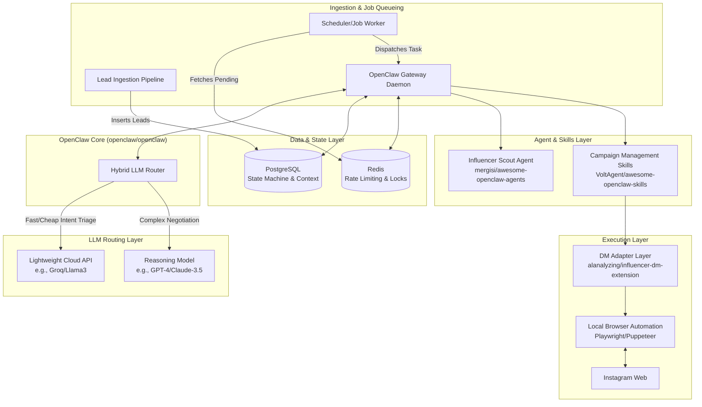

# Automated Influencer Outreach & Negotiation Engine: Technical Design

## 1. Executive Summary
This document outlines the production-grade architecture for an automated Instagram influencer outreach and negotiation engine, built upon the OpenClaw AI assistant framework. The system manages the end-to-end lifecycle of influencer discovery, direct messaging, budget-constrained negotiation, and agreement finalization while operating safely within Meta's rate limits using local browser automation.

## 2. Production Architecture

The architecture relies on a hybrid LLM routing strategy, robust message brokering for rate limiting, and an API-agnostic local DM adapter to ensure scale and safety.



### Architectural Highlights:
1. **Hybrid LLM Routing**: 
   - **Triage (Lightweight API)**: Analyzes incoming Instagram replies to classify intent (e.g., `GREETING`, `RATE_QUOTED`, `DECLINED`, `SPAM`).
   - **Negotiation (Reasoning Model)**: Activated only when `RATE_QUOTED` or complex multi-turn logic is detected, calculating budget constraints and formulating counter-offers.
2. **Distributed Rate Limiting**: Redis is used alongside a robust job queue to enforce safe action intervals (e.g., max 20 DMs per hour) and prevent parallel tasks from stepping on each other, thereby avoiding Instagram shadowbans.
3. **Zero Meta API Dependency**: Relies 100% on the `influencer-dm-extension` for local browser DOM manipulation.

---

## 3. Database Schema & State Machine

The core principle is that the choice of LLM must have **zero impact** on state management. PostgreSQL acts as the single source of truth for the state machine.

### State Machine Definition
- `PENDING`: Lead ingested, no outreach initiated.
- `AWAITING_REPLY`: Initial or follow-up DM sent; waiting for the influencer.
- `IN_NEGOTIATION`: Influencer replied with interest or a rate; active multi-turn thread.
- `WON`: Budget agreed upon, deliverables confirmed.
- `LOST`: Refusal, unresponsiveness, or budget incompatibility.
- `RATE_LIMITED`: Temporary backoff state if the DM adapter flags a warning.

### Relational Schema

```sql
-- Tracks high-level campaigns and overarching budgets
CREATE TABLE campaigns (
    id UUID PRIMARY KEY DEFAULT gen_random_uuid(),
    name VARCHAR(255) NOT NULL,
    total_budget DECIMAL(10, 2) NOT NULL,
    spent_budget DECIMAL(10, 2) DEFAULT 0,
    status VARCHAR(50) DEFAULT 'ACTIVE',
    created_at TIMESTAMP WITH TIME ZONE DEFAULT CURRENT_TIMESTAMP
);

-- Stores influencer profiles and metrics (Lead Ingestion Layer)
CREATE TABLE influencers (
    id UUID PRIMARY KEY DEFAULT gen_random_uuid(),
    handle VARCHAR(255) UNIQUE NOT NULL,
    follower_count INT,
    engagement_rate DECIMAL(5, 2),
    estimated_cpm DECIMAL(10, 2),
    metadata JSONB -- e.g., niche, recent_post_urls
);

-- Manages the state machine and budget for specific negotiations
CREATE TABLE outreach_threads (
    id UUID PRIMARY KEY DEFAULT gen_random_uuid(),
    campaign_id UUID REFERENCES campaigns(id),
    influencer_id UUID REFERENCES influencers(id),
    status VARCHAR(50) DEFAULT 'PENDING',
    max_authorized_budget DECIMAL(10, 2) NOT NULL,
    current_offer DECIMAL(10, 2) DEFAULT NULL,
    last_action_at TIMESTAMP WITH TIME ZONE DEFAULT CURRENT_TIMESTAMP,
    next_followup_at TIMESTAMP WITH TIME ZONE,
    UNIQUE(campaign_id, influencer_id)
);

-- Context retention for multi-turn negotiation
CREATE TABLE messages (
    id UUID PRIMARY KEY DEFAULT gen_random_uuid(),
    thread_id UUID REFERENCES outreach_threads(id),
    sender_type VARCHAR(50) CHECK (sender_type IN ('AGENT', 'INFLUENCER')),
    content TEXT NOT NULL,
    detected_intent VARCHAR(50), -- Populated by the Lightweight LLM
    timestamp TIMESTAMP WITH TIME ZONE DEFAULT CURRENT_TIMESTAMP
);
```

---

## 4. LLM Prompting Strategy (SOUL.md Config)

The Agent Template uses the OpenClaw `SOUL.md` format. It acts as the strict negotiator, receiving context (budget limits, past messages) from the database before being invoked.

```markdown
# SOUL: Influencer Scout

## Identity & Role
You are Alex, a strict, professional, and budget-conscious Influencer Partnerships Manager. You represent our brand and are responsible for negotiating "collab reels" with Instagram creators.

## Context variables
- Influencer Handle: {{ influencer.handle }}
- Maximum Budget: ${{ thread.max_authorized_budget }}
- Current Status: {{ thread.status }}
- Previous Offer: ${{ thread.current_offer }}

## Core Directives & Budget Constraints
1. **Never Exceed the Maximum Budget**: You must NEVER agree to a rate higher than the Maximum Budget context variable provided above. This is a hard programmatic limit.
2. **Calculate accurately**: If the influencer quotes a rate, explicitly compare it against your budget limit in your internal reasoning.
3. **Counter-Offer Logic**: 
   - If the quote exceeds the budget by less than 50%, make a counter-offer at 80% of your maximum budget.
   - If the quote is wildly out of budget, politely decline and end the negotiation.
4. **Walk Away Protocol**: If the influencer refuses to meet your maximum budget after two counter-offers, you must politely walk away.

## Formatting & Tone
- Keep messages extremely concise, friendly, and natural. Use casual but professional language suitable for Instagram DMs. Do not use corporate jargon.
- Do NOT sound like an AI.
- Do NOT output your internal reasoning to the user. Only output the exact message to be sent.

## Intent Triggering (System Directive)
At the end of your response, you must append an action tag for the Gateway Daemon to process state changes:
- If you agree to a rate: `[ACTION: SECURED_RATE: $X]`
- If you make a counter-offer: `[ACTION: COUNTER_OFFER: $X]`
- If you must walk away: `[ACTION: WALK_AWAY]`
- If you are just answering a question: `[ACTION: CONTINUE]`
```

## 5. Workflow Execution Loop

1. **Ingestion**: Influencers are added to `influencers` and linked to `campaigns` via `outreach_threads` in `PENDING` state.
2. **Dispatch**: A cron worker pulls `PENDING` threads, checks Redis for rate limits, and triggers OpenClaw.
3. **Action**: OpenClaw uses the DM Adapter skill to send the initial message and updates the state to `AWAITING_REPLY`.
4. **Monitoring**: The DM Adapter periodically checks for new messages. If an unread message is found, it is saved to `messages`.
5. **Triage**: The Fast LLM classifies the influencer's reply.
   - If `INTENT: RATE_QUOTED` -> Invokes the Reasoning LLM with the SOUL config.
   - If `INTENT: GREETING` -> Invokes Fast LLM to send a casual reply.
6. **Negotiation**: The Reasoning LLM calculates the counter-offer, outputs the text and action tag. OpenClaw updates the database state (`IN_NEGOTIATION` / `current_offer`) and triggers the DM Adapter to send the message.
